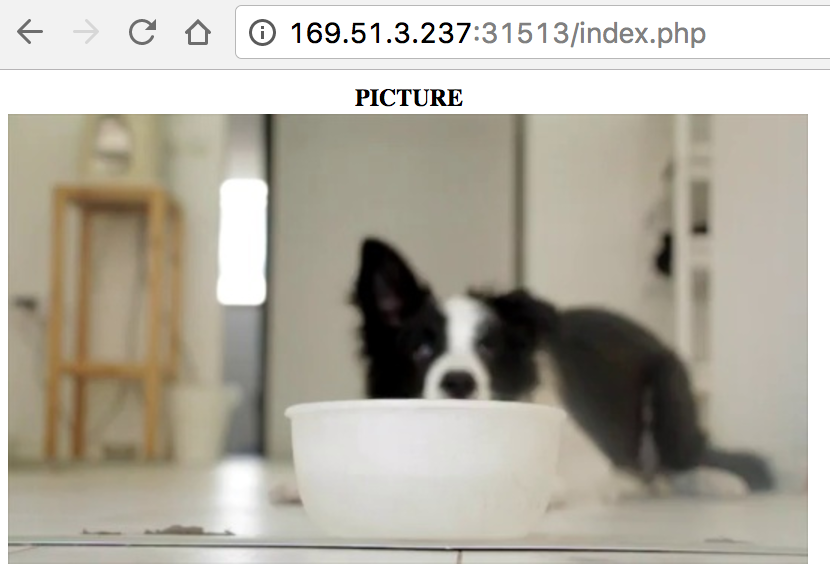

This sample is a simple PHP web page packaged into a docker container. This web page displays using S3 API a static image stored in a service [Cloud Object Storage](https://console.bluemix.net/catalog/infrastructure/cloud_object_storage). This container is deployed into Kubernetes on Bluemix.

Below is the simple web page:



Below is the complete code of the PHP page:

```html
<html>
<head></head>

<body>
  <div>
    <?php
      $image = 'https://s3-api.dal-us-geo.objectstorage.softlayer.net/bucket-watson-test-2/frame0_Dog-5631.jpg';
      $imageData = base64_encode(file_get_contents($image));
      echo '<table>';
      echo '  <tr>';
      echo '    <th>PICTURE</th> ';
      echo '  </tr>';
      echo '  <tr>';
      echo '    <td></td>';
      echo '  </tr>';
      echo '</table>';
    ?>
  </div>
</body>
</html>
```

1. Clone or download the source code for the PHP web app. (Refer to [Step 5.1](https://github.com/lionelmace/bluemix-labs/tree/master/labs/Lab%20Kubernetes%20-%20Orchestrate%20your%20docker%20containers#step-5---get-and-build-the-application-code))
    ```
    git clone https://github.com/lionelmace/php-draft-storage
    ```

1. Select the private registry based on the Bluemix Regions

| Bluemix Regions | Registry Endpoint           | Region ID |
| --------------- | --------------------------- | --------- |      
| US South        |	registry.ng.bluemix.net	    | ng        |
| Germany         |	registry.eu-de.bluemix.net  | eu-de     |
| Sydney          |	registry.au-syd.bluemix.net | au-syd    |

1. Build docker image (Refer to [Step 6.4](https://github.com/lionelmace/bluemix-labs/tree/master/labs/Lab%20Kubernetes%20-%20Orchestrate%20your%20docker%20containers#step-6---build-and-push-the-application-container))
    ```
    docker build -t registry.<region-id>.bluemix.net/<namespace>/phpstorage:v1 .
    ```

1. Run docker image locally
    ```
    docker run -p 80:80 registry.<region-id>.bluemix.net/<namespace>/phpstorage:v1
    ```

1. Push docker image to Bluemix Private Registry (Refer to [Step 6.5](https://github.com/lionelmace/bluemix-labs/tree/master/labs/Lab%20Kubernetes%20-%20Orchestrate%20your%20docker%20containers#step-6---build-and-push-the-application-container))
    ```
    docker push registry.<region-id>.bluemix.net/<namespace>/phpstorage:v1
    ```

1. Run this container as a service in Kubernetes (Refer to [Step 8.1 and 8.2](https://github.com/lionelmace/bluemix-labs/tree/master/labs/Lab%20Kubernetes%20-%20Orchestrate%20your%20docker%20containers#step-8---create-kubernetes-services-and-deployments))
    ```
    kubectl create -f deploy2kube.yml
    ```
